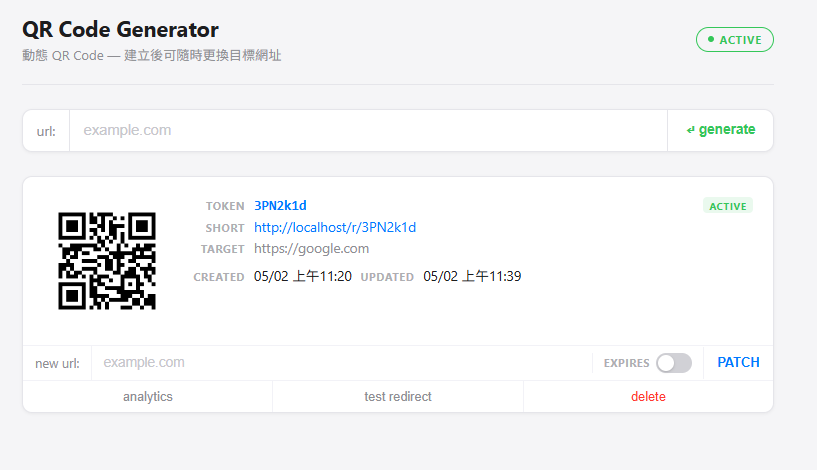

# QR Code Generator

A dynamic QR code system built with Python + FastAPI (backend) and React (frontend), containerized with Docker Compose.

## Demo



---

## Features

- Submit a long URL → receive a short URL token + QR code image
- QR code encodes the short URL which 302-redirects to the original URL
- Update the target URL after creation (dynamic QR codes — no reprinting needed)
- Soft delete (returns 410 on redirect)
- Optional expiration timestamp; expired links automatically return 410 Gone
- In-memory cache (cache-first redirect strategy, simulates Redis)
- Scan analytics (total count + per-day breakdown)
- URL validation: length check, scheme check, blocklist, normalization (upgrades to HTTPS)

---

## Tech Stack

| Layer        | Technology                              |
|--------------|-----------------------------------------|
| Backend      | Python 3.10+, FastAPI, SQLAlchemy       |
| Database     | PostgreSQL 16                           |
| Frontend     | React 18, Vite, Nginx                   |
| QR           | qrcode[pil]                             |
| Infrastructure | Docker Compose                        |

---

## System Design

### Architecture Overview

```
┌─────────────────────────────────────────────────────────────────┐
│                        Client Devices                           │
│                                                                 │
│   ┌──────────────────────────┐    ┌────────────────────────┐    │
│   │   Browser / React SPA    │    │   Phone (QR Scanner)   │    │
│   │        :80               │    │   follows short URL    │    │
│   └────────────┬─────────────┘    └───────────┬────────────┘    │
└────────────────┼──────────────────────────────┼─────────────────┘
                 │  REST API calls              │  GET /r/{token}
                 ▼                              ▼
┌─────────────────────────────────────────────────────────────────┐
│               FastAPI Server  (Uvicorn :8000)                   │
│                                                                 │
│  ┌───────────────────────────────────────────────────────────┐  │
│  │  CORS Middleware                                          │  │
│  └───────────────────────────┬───────────────────────────────┘  │
│                              │                                  │
│  ┌───────────────────────────▼───────────────────────────────┐  │
│  │  Router  (routes.py)                                      │  │
│  │                                                           │  │
│  │  POST /api/qr/create  ──► url_validator ──► token_gen     │  │
│  │  GET  /api/qr/{token}       info lookup                   │  │
│  │  PATCH /api/qr/{token} ──► url_validator                  │  │
│  │  DELETE /api/qr/{token}     soft delete                   │  │
│  │  GET  /api/qr/{token}/image ──► qrcode.make() → PNG       │  │
│  │  GET  /api/qr/{token}/analytics  scan stats               │  │
│  │  GET  /r/{token}  ──────────────────────────────────┐     │  │
│  └─────────────────────────────────────────────────────┼─────┘  │
│                                                        │        │
│  ┌─────────────────────────┐    ┌──────────────────────▼─────┐  │
│  │   In-Memory Cache       │    │   Cache-First Redirect     │  │
│  │   (process-scoped dict) │◄───│   1. check cache           │  │
│  │                         │    │   2. miss → query DB       │  │
│  │   token → original_url  │    │   3. populate cache        │  │
│  └─────────────────────────┘    │   4. record ScanEvent      │  │
│                                 │   5. 302 / 410 / 404       │  │
│                                 └────────────────────────────┘  │
│                                                                 │
│  ┌───────────────────────────────────────────────────────────┐  │
│  │  SQLAlchemy ORM  ──►  PostgreSQL 16                       │  │
│  │                                                           │  │
│  │   url_mappings                  scan_events               │  │
│  │   ─────────────────────         ───────────────────────   │  │
│  │   id            PK INT          id          PK INT        │  │
│  │   token         UNIQUE VARCHAR  token       VARCHAR       │  │
│  │   original_url  TEXT            scanned_at  DATETIME      │  │
│  │   expires_at    DATETIME NULL   user_agent  VARCHAR NULL  │  │
│  │   is_deleted    BOOLEAN         ip_address  VARCHAR NULL  │  │
│  │   created_at    DATETIME                                  │  │
│  │   updated_at    DATETIME                                  │  │
│  └───────────────────────────────────────────────────────────┘  │
└─────────────────────────────────────────────────────────────────┘
```

### Data Flow: Create QR Code

```
Browser                    FastAPI                   PostgreSQL
   │                          │                         │
   │  POST /api/qr/create     │                         │
   │  { url, expires_at? }    │                         │
   │─────────────────────────►│                         │
   │                          │  validate_url()         │
   │                          │  normalize + blocklist  │
   │                          │                         │
   │                          │  generate_token()       │
   │                          │  SHA-256 + Base62(7)    │
   │                          │  retry on collision     │
   │                          │                         │
   │                          │  INSERT url_mappings    │
   │                          │────────────────────────►│
   │                          │                         │
   │                          │  populate redirect_cache│
   │                          │                         │
   │  { token, short_url,     │                         │
   │    qr_code_url,          │                         │
   │    original_url }        │                         │
   │◄─────────────────────────│                         │
   │                          │                         │
   │  GET /api/qr/{token}/image                         │
   │─────────────────────────►│                         │
   │                          │  qrcode.make(short_url) │
   │  PNG image (streamed)    │  → StreamingResponse    │
   │◄─────────────────────────│                         │
```

### Data Flow: QR Code Scan (Redirect)

```
Phone                      FastAPI              Cache        PostgreSQL
  │                           │                   │             │
  │  GET /r/{token}           │                   │             │
  │──────────────────────────►│                   │             │
  │                           │  token in cache?  │             │
  │                           │──────────────────►│             │
  │                           │                   │             │
  │            ┌──────────────┴───── HIT ─────────┘             │
  │            │              │  check expiry                   │
  │            │              │  expired → 410                  │
  │            │              │  valid   → record ScanEvent ───►│
  │            │              │           302 redirect          │
  │            │              │                                 │
  │            └──────────────┴───── MISS ───────────────────►  │
  │                           │                    query DB ───►│
  │                           │                    not found    │
  │                           │                    → 404        │
  │                           │                    deleted /    │
  │                           │                    expired      │
  │                           │                    → 410        │
  │                           │                    found        │
  │                           │                    → populate   │
  │                           │                      cache      │
  │                           │                    → record     │
  │                           │                      ScanEvent  │
  │  302 → original_url       │                    → 302        │
  │◄──────────────────────────│                                 │
```

---

## Project Structure

```
QRCode-generator/
├── api/
│   ├── app/
│   │   ├── main.py          # FastAPI app, CORS
│   │   ├── database.py      # SQLAlchemy engine + session
│   │   ├── models.py        # UrlMapping, ScanEvent
│   │   ├── schemas.py       # Pydantic request/response types
│   │   ├── routes.py        # All API endpoints
│   │   ├── token_gen.py     # SHA-256 + Base62 token generation
│   │   └── url_validator.py # URL validation + normalization
│   ├── Dockerfile
│   └── requirements.txt
├── frontend/
│   ├── src/
│   │   ├── App.jsx          # Root component, manages QR code list
│   │   └── api.js           # API call wrappers
│   ├── nginx.conf
│   └── Dockerfile
├── images/
│   └── qr-code-generator-demo.png
└── docker-compose.yml
```

---

## Getting Started

**Prerequisites:** Docker & Docker Compose

```bash
git clone <repo-url>
cd QRCode-generator
docker compose up --build
```

| Service  | URL                    |
|----------|------------------------|
| Frontend | http://localhost       |
| API      | http://localhost:8000  |

### Local Development (without Docker)

**Backend**

```bash
cd api
python3 -m venv .venv
source .venv/bin/activate
pip install -r requirements.txt
DATABASE_URL=postgresql://<user>:<pass>@localhost:5432/qr_code \
  BASE_URL=http://localhost:8000 \
  uvicorn app.main:app --reload
```

**Frontend**

```bash
cd frontend
npm install
npm run dev
```

---

## API Reference

| Method   | Path                            | Description                           |
|----------|---------------------------------|---------------------------------------|
| `POST`   | `/api/qr/create`                | Create QR code, returns token + URLs  |
| `GET`    | `/r/{token}`                    | 302 redirect (410 if deleted/expired) |
| `GET`    | `/api/qr/{token}`               | Get mapping info                      |
| `PATCH`  | `/api/qr/{token}`               | Update target URL and/or expiry       |
| `DELETE` | `/api/qr/{token}`               | Soft delete                           |
| `GET`    | `/api/qr/{token}/image`         | QR code PNG image                     |
| `GET`    | `/api/qr/{token}/analytics`     | Total scans + per-day breakdown       |

**404 vs 410:** `/r/{token}` returns 410 for deleted or expired tokens, 404 for tokens that never existed.